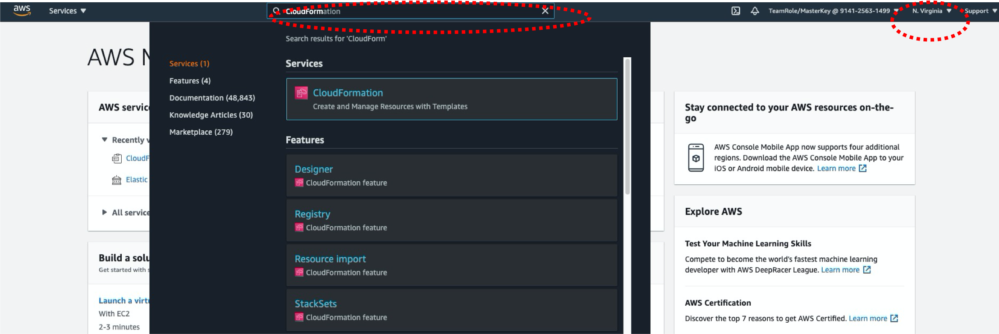

# Lab1: EKS for CNF engineer (Environment creation)

### Please keep in mind..
* You only have to use 'us-west-2' Region not the one closest to you. (make it sure, you should be with "Oregon" - please refer to below console view).
* As of today (11/28/2021), if we run infra cloudformation, then EKS cluster is created with K8s 1.21 version. 

## 1. Please download CFN template for this Lab
*to download these from GitHub at once, please select "Code" on the top left corner of menu, and then click green "Code" menu and then select "Download Zip" file.*
* CFN repo1: https://github.com/crosscom/AWS-Immersion-Day/blob/main/Lab1/template/aws-immersion-infra.yaml
    * This creates VPC, public/private subnets, subnet route tables, IGW, NAT-GW, Security Groups, EKS Cluster and Bastion Instance
* CFN repo2: https://github.com/crosscom/AWS-Immersion-Day/blob/main/Lab1/template/amazon-eks-nodegroup-multus.yaml
    * This creates Autoscaling group to be used for worker node group of your EKS cluster. This also creates Lambda function for multus-ready worker node group.
* Lambda Function Zip: https://github.com/crosscom/AWS-Immersion-Day/blob/main/Lab1/template/lambda_function.zip
    * Lambda function to be used along with CFN repo2 (worker node group stack). 

## 2. Log in to AWS Console 


## 3. Create Environment with CloudFormation
* Type "CloudFormation" at search service section and go to CloudFormation.
* Create Stack -> upload a template file -> Choose file (select downloaded "aws-immersion-infra.yaml").
* Keep default values in configuraiton of CloudFormation Template. 
    * AvailabilityZones --> choose us-west-2a and us-west-2b (2 AZs required for EKS creation).
    * BastionKeyPairName --> select 'ee-dfault-keypair' from dropdown menu. 
    * Click "Next"
* There is nothing to specify in "Configure Stack options" page, so please click again "Next" at the bottom. 
* At Review page, go bottom of the page and click checkbox for "I acknowledge that AWS...", and then click "Create stack". 


## 4. Login to Bastion Host 
* Usually in eksworkshop or normal immersion day offered by AWS, we guide customer to experience Cloud9 (AWS IDE environment). But in this workshop, plan is to provide a general environment with your own Bastion Host EC2, where you have to install kubectl tools and other tools as needed.
* (General)
    * We can use EC2 Instance Connect to login to EC2 instance.
    * EC2->Instances->"connect" (right top corner of screen). 
    * click "connect"

* (MAC user) Log in from your laptop
    * Let's use key pair we downloaded to access to the instance.

  ````
  chmod 600 ee-default-keypair.pem
  ssh-add ee-default-keypair.pem
  ssh -A ec2-user@54.208.182.244
  ````

    * Copy AWS credentials (AWS_DEFAULT_REGION, AWS_ACCESS_KEY_ID, AWS_SECRET_ACCESS_KEY; be mindful that you have to use your own not below one, that I asked youto copy at Step 2).

  ````
  export AWS_DEFAULT_REGION=us-west-2
  export AWS_ACCESS_KEY_ID=ASIA..
  export AWS_SECRET_ACCESS_KEY=4wyDA..
  export AWS_SESSION_TOKEN=IQo...
  ````

    * Try whether AWS confidential is already configured well

    ````
    aws sts get-caller-identity
    {
      "Account": "400888888888", 
      "UserId": "AROAV2K6K7UQPEU2EAAAA:MasterKey", 
      "Arn": "arn:aws:sts::400888888888:assumed-role/TeamRole/MasterKey"
    }
    ````

* (Window user) Log in from your laptop 
    * Please use PuTTy and refer to the guide, https://docs.aws.amazon.com/AWSEC2/latest/UserGuide/putty.html

## 5. Make a Bastion Host to be a kubectl client

* Download kubectl. 

  ````
  curl -o kubectl https://amazon-eks.s3.us-west-2.amazonaws.com/1.20.4/2021-04-12/bin/linux/amd64/kubectl
  curl -o kubectl.sha256 https://amazon-eks.s3.us-west-2.amazonaws.com/1.20.4/2021-04-12/bin/linux/amd64/kubectl.sha256
  openssl sha1 -sha256 kubectl
  chmod +x ./kubectl
  mkdir -p $HOME/bin && cp ./kubectl $HOME/bin/kubectl && export PATH=$PATH:$HOME/bin
  echo 'export PATH=$PATH:$HOME/bin' >> ~/.bashrc
  kubectl --help
  ````

* Check your name of EKS cluster (from CloudFormation output or EKS console (service search -> EKS)) - you provided this name in Step3 CloudFormation creation.

* Config kubeconfig with EKS CLI (*please be mindful to use your own cluster name in below instead of eks-my-first-stack), you have to check your EKS cluster name you created from the CloudFormation*)
  ````
  aws eks update-kubeconfig --name=eks-my-first-stack
  ````

* Verify kubectl command
  ````
  kubectl get svc
  NAME         TYPE        CLUSTER-IP   EXTERNAL-IP   PORT(S)   AGE
  kubernetes   ClusterIP   172.20.0.1   <none>        443/TCP   31m
  ````

* Verify it from AWS CLI
  ````
  aws eks describe-cluster --name=eks-my-first-stack
  ````

## 6. Self-managed Node Group creation (for Multus CNI required applications)
* Go to S3 and create bucket (folder/directory) with *Create bucket*.
* Bucket name to be unique like *young-jung-immersion* (recommend to use your name or unique keyword), and then *Create bucket*.
* Click the bucket you just created and drag & drop lambda_function.zip file (which you can find from /template directory of this GitHub). Then, click *Upload*.
* Please memorize bucket name you create (this is required in CloudFormation)
* Go to CloudFormation console by selecting CloudFormation from Services drop down or by search menu. 
    * Select *Create stack*, *with new resources(standard)*.
    * Click *Template is ready" (default), "Upload a template file", "Choose file". Select "amazon-eks-nodegroup-multus.yaml" file that you have downloaded from this GitHub. 
    * Stack name -> ng1
    * ClusterName -> eks-immersion (your own name)
    * ClusterControlPlaneSecurityGroup -> "immersion-EksControlSecurityGroup-xxxx"
    * NodeGroupName -> ng1
    * Min/Desired/MaxSize -> 1/1/1
    * KeyName -> ee-default-keypair
    * VpcId -> vpc-immersion (that you created)
    * Subnets -> privateAz1-immersion (this is for main primary K8s networking network)
    * MultusSubnets -> multusSigAz1
    * MultusSecurityGroups -> immersion-MultusSecurityGroup
    * LambdaS3Bucket -> the one you created (young-jung-immersion)
    * LambdaS3Key -> lambda_function.zip
    * There is nothing to specify in "Configure Stack options" page, so please click again "Next" at the bottom.
    * At Review page, go bottom of the page and click checkbox for "I acknowledge that AWS...", and then click "Create stack".
    
* Once CloudFormation stack creation is completed, check *Output* part in the menu and copy the value of NodeInstanceRole (e.g. arn:aws:iam::153318889914:role/ng1-NodeInstanceRole-1C77OUUUP6686 --> this is an example, you have to use your own)
* Go to the Bastion Host where we can run kubectl command. 
* Download aws-auth-cm file at Bastion Host.
  ````
  curl -o aws-auth-cm.yaml https://s3.us-west-2.amazonaws.com/amazon-eks/cloudformation/2020-10-29/aws-auth-cm.yaml
  ````

* Open aws-auth-cm.yaml file downloaded using vi or any text editor. And place above copied NodeInstanceRole value to the place of "*<ARN of instance role (not instance profile)>*", and then apply this through kubectl.
  ````
  kind: ConfigMap
  metadata:
    name: aws-auth
    namespace: kube-system
  data:
    mapRoles: |
      - rolearn: arn:aws:iam::153318889914:role/ng1-NodeInstanceRole-1C77OUUUP6686
        username: system:node:{{EC2PrivateDNSName}}
        groups:
          - system:bootstrappers
          - system:nodes
  ````
  ````
  kubectl apply -f aws-auth-cm.yaml
  ````
  
 * Verfiy node group is created under your cluster. 
 ````
 kubectl get nodes
 ````

If all creation looks good (kubectl get nodes command shows worker node instance), then let's move to [Lab2](https://github.com/crosscom/AWS-Immersion-Day/tree/main/Lab2).
