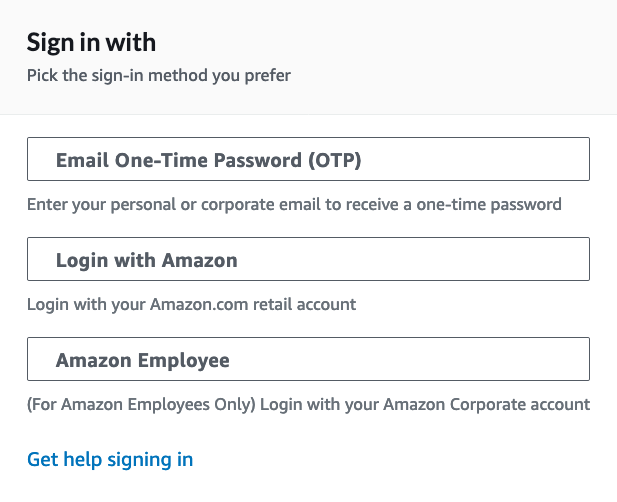
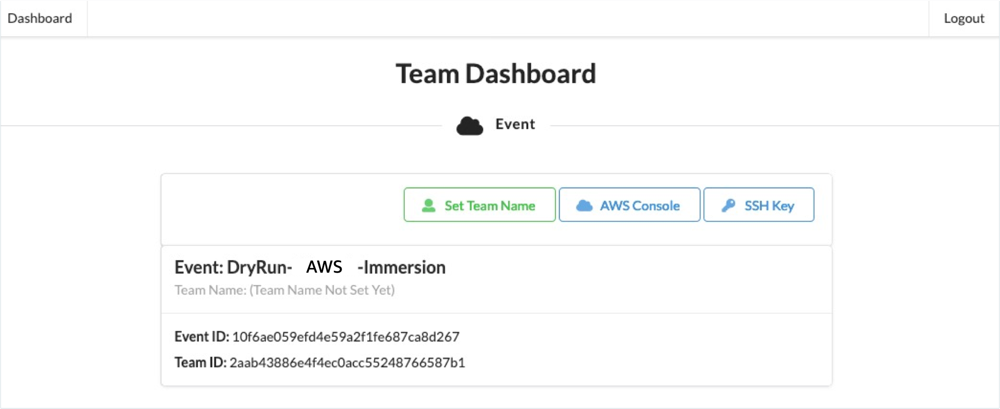

# AWS-Immersion-Day for CNF engineers (dev/test) in Telco

### Please keep in mind..
* You only have to use 'us-west-2' Region not the one closest to you.

## Log in to AWS Event Engine 
* https://dashboard.eventengine.run/dashboard.
* Please put Event Hash (will be given at the session from your instructor). 
* Please use OTP authentication with your email.
  
* Click "Set Team Name" (Team is equivalent to the account)
    * Please put TEAM name to be your name (table+your-name).  
    
* Click "SSH key" 
    * Download **ee-default-keypair** to your PC (just in case, copy key material to notepad as well).
* Click "AWS Console"
    * Copy credentials (export AWS_DEFAULT_REGION=..) 
    * Click "Open AWS Console".

## What we will learn today? 
* **[Lab1](https://github.com/crosscom/AWS-Immersion-Day/tree/main/Lab1)**: EKS environment creation (VPC, Subnets, EKS cluster, Multus-ready worker node) for CNF deployment.
* **[Lab2](https://github.com/crosscom/AWS-Immersion-Day/tree/main/Lab2)**: Creating dummy multi-homed Pod application (multus) from the image from ECR.
